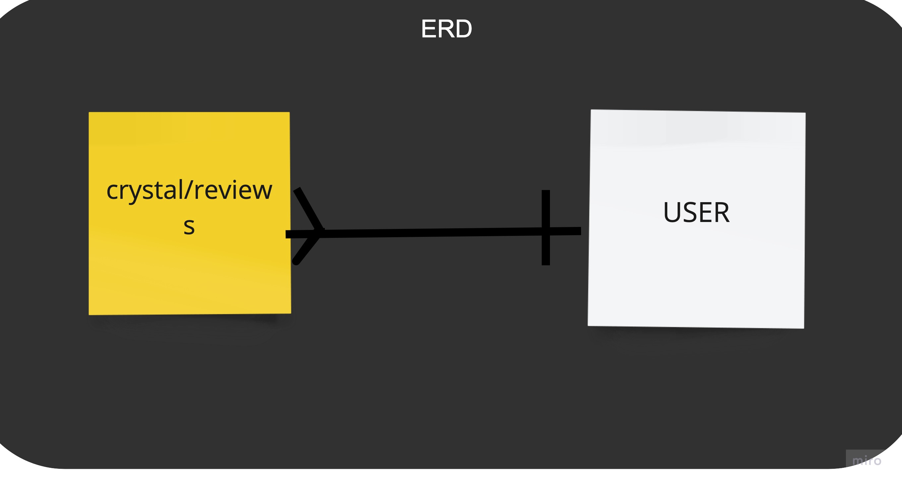

# crystals-API : A Description
#### This application allows the user to create an account, login and perform CRUD actions on their crystal database.

## Useful Links:
(https://github.com/cesarinag/crystals-client "crystals-client Repo")
(https://arcane-meadow-00738.herokuapp.com/ "API Deployed Site")
(https://cesarinag.github.io/crystals-client/ "Client Deployed Site")

## Planning:
#### My game plan for this project was essentially getting the backend routes working first and then focusing on the frontend.

## User Stories:
* As a new user, I am able to sign up
* As a registered user, I am able to sign in
* As a signed in user, I am able to change password
* As a signed in user, I am able to sign out
* As a signed in user, I am able to add a crystal to my database
* As a signed in user, I am able to view all crystals in the database
* As an owner of my crystal, I am able to update information about my crystal
* As an owner of my crystal, I am able to delete my crystal if I no longer find it's no longer useful

## Technologies Used:
* HTML
* CSS/SCSS
* Bootstrap
* JavaScript
* jQuery
* Shell
* MongoDB/Atlas
* Heroku
* Express API
* AJAX

## Unsolved Problems:
* I'd still like to be able to let users upload pictures for their crystals
* I'd still like to let users change languages (esp. Spanish) so my mom can see what I made
* I'd like to move the change-password into a modal and prompt it in case someone forgets their password
* I'd like to add mobile functionality
* I'd like to play around with hide and show functionality
* I'd like to play add another resource so users can add reviews or comment on other user's crystal rituals

## Wireframes:

